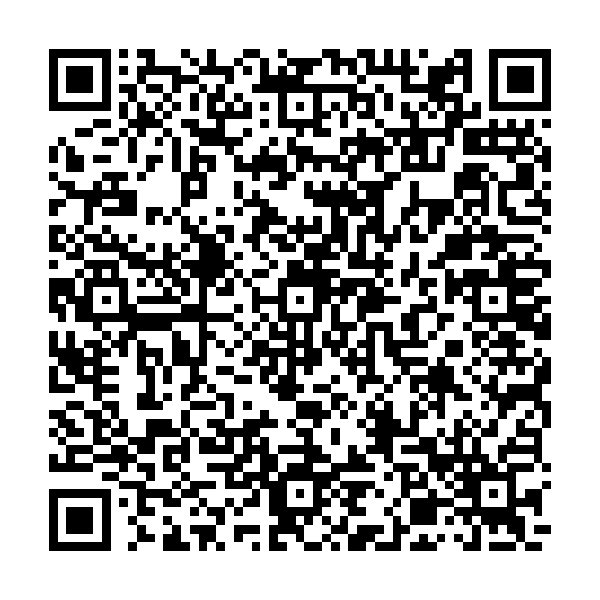

# Shadowrocket Rules

面向 iOS Shadowrocket 的规则配置。导入配置后，在 Shadowrocket 首页添加自己的节点或订阅即可使用。

> 当前版本：2026-08-27
> 当前仓库：[`youngtreebig-droid/Shadowrocket-Rules`](https://github.com/youngtreebig-droid/Shadowrocket-Rules)
> 源仓库：[`LingJingMaster/Shadowrocket-Rules`](https://github.com/LingJingMaster/Shadowrocket-Rules)

配置文件不包含任何代理节点信息；节点和订阅只保存在你自己的 Shadowrocket 中。

## 配置入口

配置文件 Raw 链接：

```text
https://raw.githubusercontent.com/youngtreebig-droid/Shadowrocket-Rules/refs/heads/main/Shadowrocket.conf
```

也可以扫描下面的二维码导入：



二维码和 Raw 链接都指向当前仓库 `main` 分支的 `Shadowrocket.conf`。配置更新并推送到 `main` 后，Shadowrocket 的 `update-url` 会继续使用这个地址。

## 快速开始

1. 打开 Shadowrocket → **配置** → 右上角 **+**。
2. 粘贴上面的 Raw 链接并下载配置。
3. 点击下载的配置，选择**使用中**。
4. 返回首页，添加自己的节点或订阅。
5. 在 `Proxy`、`🚀 节点选择` 或地区策略组中手动选择节点。
6. 测试连接并启用 Shadowrocket。

## 本配置的主要行为

- **MissAV**：先通过 `MissAV.list` 匹配主站、视频/图片 CDN 和推荐接口，再用 `DOMAIN-KEYWORD,missav` 兜底，默认进入 `🇺🇸 美国节点`。
- **手动固定节点**：`Proxy` 和所有地区策略组均为 `select`，不再使用 `url-test` 的定时测速和自动切换。
- **Proxy 组**：新增 `Proxy` 手动代理组，自动收集已添加的节点，解决没有独立代理组供 `Select Proxy` 选择的问题。
- **主节点选择**：`🚀 节点选择` 默认选择 `Proxy`，也可以切换到香港、台湾、日本、新加坡、美国、韩国、越南、马来西亚或其他节点组。
- **地区识别**：地区组依据节点名称关键词匹配，请保证节点名称包含对应的国家/地区名称、常用英文缩写或国旗。
- **倍率过滤**：所有策略组排除节点名称中明确标注为 2 倍及以上的节点（如 `[2.0]`、`[3]`、`[4]`、`2x`、`4倍`），避免误用高倍率节点。

## 策略组

| 策略组 | 类型 | 默认选择 | 说明 |
|---|---|---|---|
| `Proxy` | `select` | 第一个节点 | 汇总已添加的节点，手动固定选择 |
| `🚀 节点选择` | `select` | `Proxy` | 主策略组 |
| `🇭🇰 香港节点` | `select` | 第一个匹配节点 | 按节点名称匹配香港节点 |
| `🇹🇼 台湾节点` | `select` | 第一个匹配节点 | 按节点名称匹配台湾节点 |
| `🇯🇵 日本节点` | `select` | 第一个匹配节点 | 按节点名称匹配日本节点 |
| `🇸🇬 新加坡节点` | `select` | 第一个匹配节点 | 按节点名称匹配新加坡节点 |
| `🇺🇸 美国节点` | `select` | 第一个匹配节点 | 按节点名称匹配美国节点 |
| `🇰🇷 韩国节点` | `select` | 第一个匹配节点 | 按节点名称匹配韩国节点 |
| `🇻🇳 越南节点` | `select` | 第一个匹配节点 | 按节点名称匹配越南节点 |
| `🇲🇾 马来西亚节点` | `select` | 第一个匹配节点 | 按节点名称匹配马来西亚节点 |
| `🌐 其他节点` | `select` | 第一个匹配节点 | 匹配未归入上述地区的节点 |

`PROXY` 是规则语法中的通用代理策略标识，不等于配置中声明的 `Proxy` 策略组。本配置显式声明了 `Proxy` 组，并将相关默认目标改为该 `select` 组，便于手动固定节点。

节点名称中带有 2 倍及以上倍率标记的节点可能仍显示在 Shadowrocket 的原始节点列表中，但不会被本配置的 `Proxy`、地区组或主策略组收录。

## 分流规则优先级

规则按从上到下的顺序匹配：

| 优先级 | 服务 | 默认策略 |
|---:|---|---|
| 1 | DNS 防泄露 / HTTPDNS | `REJECT` |
| 2 | MissAV 主站、CDN、推荐接口及含 `missav` 的域名 | `🇺🇸 美国节点` |
| 3 | 谷歌服务（含 Gemini） | `🇯🇵 日本节点` |
| 4 | AI 服务（ChatGPT、Claude 等） | `🇺🇸 美国节点` |
| 5 | 油管视频 | `🚀 节点选择` |
| 6 | 哔哩哔哩 | `🔒 国内服务` |
| 7 | 私有网络 / 局域网 | `🏠 私有网络` |
| 8 | 电报消息 | `📲 电报消息` |
| 9 | GitHub、GitLab、Atlassian | `🐱 代码托管` |
| 10 | 微软服务 | `Ⓜ️ 微软服务` |
| 11 | 汇丰香港及 Reward+ | `🏦 汇丰香港` |
| 12 | 其他香港银行 | `🏦 香港银行` |
| 13 | 券商服务 | `📈 券商服务` |
| 14 | Apple Push | `🍎 苹果推送` |
| 15 | 其他苹果服务 | `🍏 苹果服务` |
| 16 | 国内服务 | `🔒 国内服务` |
| 17 | 其他境外流量 | `🌍 非中国` |
| 18 | 中国大陆 IP | `🔒 国内服务` |
| 19 | 未匹配流量 | `🐟 漏网之鱼` |

Google 规则位于 AI 规则之前，因此 Gemini 等同时匹配两类规则的域名优先使用 `🔍 谷歌服务`。

## 本仓库维护的规则集

下面这些文件使用当前仓库的 Raw 地址，修改后会随 `main` 分支更新：

| 文件 | Raw 地址 |
|---|---|
| `MissAV.list` | `https://raw.githubusercontent.com/youngtreebig-droid/Shadowrocket-Rules/refs/heads/main/MissAV.list` |
| `Google.list` | `https://raw.githubusercontent.com/youngtreebig-droid/Shadowrocket-Rules/refs/heads/main/Google.list` |
| `AI.list` | `https://raw.githubusercontent.com/youngtreebig-droid/Shadowrocket-Rules/refs/heads/main/AI.list` |
| `HSBC_HK.list` | `https://raw.githubusercontent.com/youngtreebig-droid/Shadowrocket-Rules/refs/heads/main/HSBC_HK.list` |
| `HK_Banks_Direct.list` | `https://raw.githubusercontent.com/youngtreebig-droid/Shadowrocket-Rules/refs/heads/main/HK_Banks_Direct.list` |
| `HK_Broker.list` | `https://raw.githubusercontent.com/youngtreebig-droid/Shadowrocket-Rules/refs/heads/main/HK_Broker.list` |
| `ApplePush.list` | `https://raw.githubusercontent.com/youngtreebig-droid/Shadowrocket-Rules/refs/heads/main/ApplePush.list` |
| `Apple.list` | `https://raw.githubusercontent.com/youngtreebig-droid/Shadowrocket-Rules/refs/heads/main/Apple.list` |

其他公共规则集主要来自：

- [blackmatrix7/ios_rule_script](https://github.com/blackmatrix7/ios_rule_script)
- [iab0x00/ProxyRules](https://github.com/iab0x00/ProxyRules)
- MissAV 主站后缀参考 [v2fly/domain-list-community](https://github.com/v2fly/domain-list-community/blob/master/data/missav) 和 [sub-kek/shadowrocket-lists](https://github.com/sub-kek/shadowrocket-lists/blob/master/shadowrocket/missav.list)。
- MissAV CDN / 推荐接口参考 [zijinan/Loon-rule](https://github.com/zijinan/Loon-rule/blob/main/Loon/rule/MissAV.list)。

## 上游更新与合并

### Fork 不会自动同步

GitHub 的 fork 不会因为源仓库更新而自动修改本仓库。当前关系是：

- `origin`：你的仓库 `youngtreebig-droid/Shadowrocket-Rules`
- `upstream`：源仓库 `LingJingMaster/Shadowrocket-Rules`

在 GitHub 网页端可以打开本仓库，点击 **Sync fork → Update branch**。没有冲突时 GitHub 会直接同步；有冲突时需要手动处理。

本地同步方式：

```bash
git remote add upstream https://github.com/LingJingMaster/Shadowrocket-Rules.git
git fetch upstream
git switch main
git merge upstream/main
# 解决冲突后：
git add .
git commit
git push origin main
```

### 我的修改会不会自动合并

不会保证自动合并，具体取决于修改位置：

- 上游修改与本仓库修改不在同一段代码：Git 通常可以自动合并。
- 上游同时修改 `[Proxy Group]`、`[Rule]` 或 README 中的相同内容：会产生冲突，需要手动选择保留哪一方。
- `MissAV.list`、MissAV 关键词兜底、`Proxy` 组以及 `url-test` → `select` 的改动，只要上游没有重写对应区域，通常会保留。
- 合并后应检查 Raw 链接，确保仍然指向 `youngtreebig-droid/Shadowrocket-Rules`，不要被上游 README 或配置覆盖回源仓库地址。

建议每次先查看上游差异，再同步到 `main`；不要盲目启用自动合并，以免覆盖手动选节点和 MissAV 规则。

## 访问权限

当前仓库是公开仓库，因此任何人都可以查看文件并访问 Raw 链接。公开仓库才能直接支持 Shadowrocket 扫码导入和无登录自动更新。

由于这是公开仓库的 fork，不能单独将它改成私有并继续保留 fork 关系。若必须只自己访问，需要新建一个**私有的独立仓库**并推送代码副本，再自行配置上游 remote；但 GitHub 私有 Raw 链接通常需要登录鉴权，Shadowrocket 直接扫码或自动更新可能无法读取。

## 其他说明

- 银行和券商服务对出口 IP 稳定性较敏感，建议手动固定同一个香港节点。
- 如需 HTTPS 解密，请在 Shadowrocket 中生成并安装 CA 证书。
- `MissAV.list`、倍率过滤、localhost.weixin.qq.com、局域网反向解析、Apple Push、HTTPDNS 拦截等优化已包含在配置中。

## License

MIT
